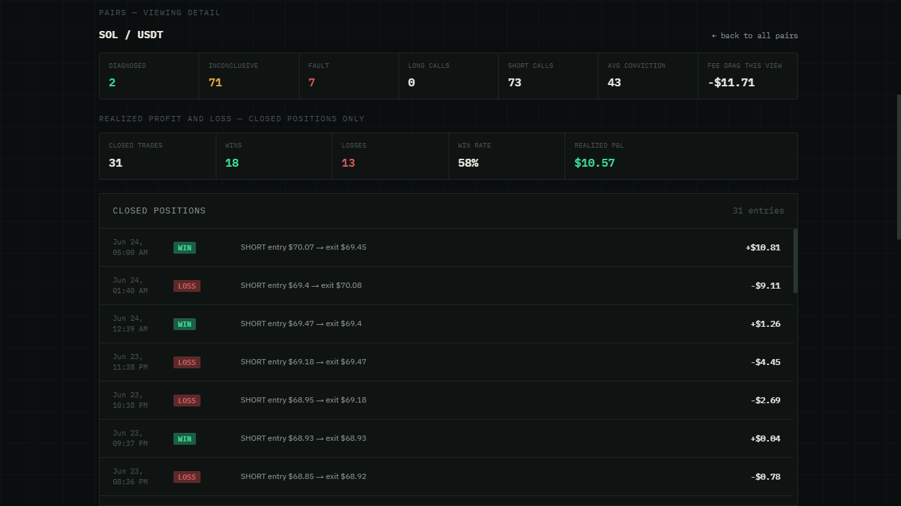
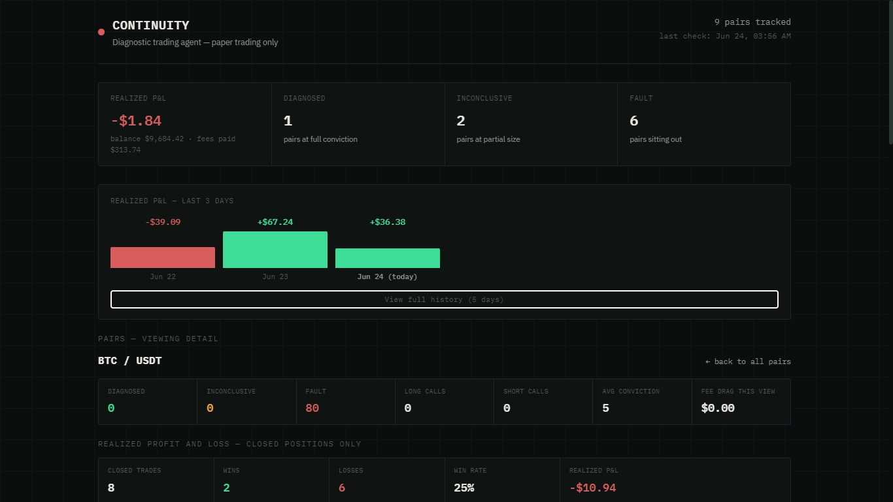
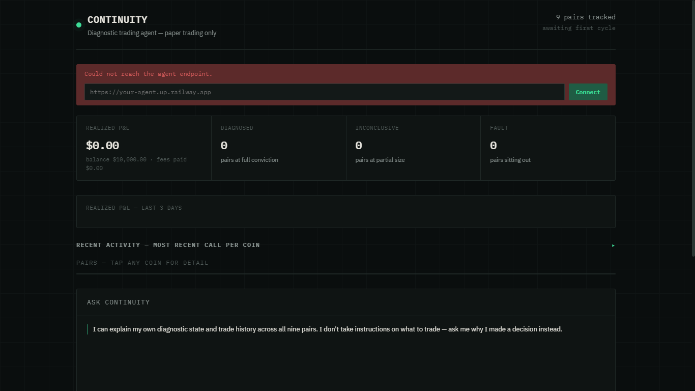

# Continuity

An autonomous diagnostic trading agent built for **Bitget AI Base Camp Hackathon S1 — Trading Agent track**.

Paper trading only. No real funds are used at any point.

**Live dashboard:** https://wisdomkings001.github.io/continuity/dashboard/index.html

**Agent endpoint:** https://continuity-production-ce7d.up.railway.app

---

## The idea

Most trading bots act constantly so they look "active." Continuity does the opposite: every cycle, it runs a diagnostic on the market and only commits paper size when its signals genuinely agree with each other. When they don't, it says so and refuses to trade rather than force a guess.

It tracks **nine pairs independently** — BTC, ETH, SOL, BNB, XRP, DOGE, ADA, AVAX, LINK (all vs USDT) — sharing one paper balance across all of them, like one book across a small portfolio. A strong signal on one coin and a refusal on another in the same sweep is expected: conviction is judged per-market, not as one blanket mood for "crypto."

---

## How it decides

Every 15 minutes, three signals are checked per pair:

- **Trend** — recent price momentum
- **Volatility** — how noisy the last few candles have been; dampens conviction, doesn't add direction
- **Sentiment** — funding rate and long/short positioning, but only when genuinely extreme. Routine long-skew (the 1.4–2.0 range most perpetuals sit in most of the time) carries no signal — only an extreme reading counts, and it's treated as a contrarian warning, not confirmation (a crowded trade is a risk, not a green light)

How strongly trend and sentiment *agree* — not their raw average — produces a 0–100 conviction score, which decides what happens:

| Conviction | State | Action |
|---|---|---|
| 0–29 | `FAULT` | Refuses to trade. Logs why. |
| 30–69 | `INCONCLUSIVE` | Reduced-size paper position. |
| 70–100 | `DIAGNOSED` | Full-size paper position. |

Every cycle writes a row to the log regardless of outcome — including refusals. A trading system's discipline shows up as much in what it won't do as in what it trades.



---

## What happens after a trade opens

A position isn't just logged and forgotten — it's held for up to **one hour**, then closed against the real live price and scored as an actual win or loss. If it moves **2% against entry** before the hour is up, it closes early instead of riding out a bad call — a stop-loss, checked independently every few minutes, not just at the one-hour mark.

This is written to a separate `closed_trades.csv`, so the original per-cycle decision log stays untouched. The dashboard shows win rate, total realized P&L, and every closed trade per pair.


---

## A real bug, found and fixed with real data

After running for a while, the closed-trade log showed every single position going long, never short — with losses concentrated in the highest-conviction calls. The cause: sentiment treated *any* long-skewed positioning as bullish confirmation, but that skew is the structural norm for crypto perpetuals, not a meaningful signal. It was quietly biasing the whole system toward long regardless of actual conditions.

The fix only treats genuinely extreme positioning as a signal, and reads it as contrarian. It was tested against the exact real trades that exposed the bug before being deployed — this is the kind of issue that only shows up once an agent runs with real, money-shaped consequences, not something a backtest alone would surface.



---

## Staying alive

Hosting can restart a container at any time. Three things make sure that doesn't cost real history:

- Trade log, closed-trades log, and full state (including open positions) back up to GitHub every hour
- On startup, if no local state exists, the last backup is restored before falling back to a fresh balance
- Any open position is checked immediately on startup and on its own 3-minute timer — never left waiting on the slower full signal sweep to notice a stop-loss has been breached

---

## Project structure

```
continuity/
├── agent/
│   ├── agent.js         # diagnostic engine, paper trading, P&L, status API
│   ├── explain.js       # read-only "ask the agent" explainer
│   ├── package.json
│   ├── railway.json
│   └── data/            # generated at runtime, not committed
└── dashboard/
    └── index.html       # single-file live dashboard, no build step
```

---

## Running it yourself

**Requirements:** Node.js 18+ (uses the built-in `fetch`). A Bitget account isn't required — the agent only reads public market data.

```bash
cd agent
npm install   # no real dependencies, just a formality
node agent.js
```

It sweeps all nine pairs on startup, then every 15 minutes after. A small HTTP server (default port 3000) exposes:

| Endpoint | Returns |
|---|---|
| `GET /status` | balance, cycle count, latest decision per pair |
| `GET /log?n=100&pair=` | recent diagnostic log rows, optionally filtered |
| `GET /pnl?n=100&pair=` | closed positions, realized P&L, win rate |
| `POST /ask` | `{"question": "..."}` → plain-language, data-grounded answer |
| `GET /health` | `ok` |
| `POST /sync` | forces an immediate GitHub backup |

Ask `/ask` about a specific coin by name ("why didn't you trade SOL") for a pair-specific answer, or ask generally for one across all nine.

### Configuration

Everything lives in `CONFIG` at the top of `agent.js` — pairs, interval, starting balance, conviction thresholds, stop-loss percentage, hold window. No environment variables are required to run it.

| Variable | Effect if set | If unset |
|---|---|---|
| `BITGET_API_KEY` | higher rate limits on market data | agent runs the same |
| `GITHUB_TOKEN` + `GITHUB_REPO` | hourly backup + restore-on-restart | log only persists locally |

### Viewing the dashboard

Open `dashboard/index.html` directly — no server needed. First load asks for the agent's URL (your Railway domain, or `http://localhost:3000` locally); 
---

## Deploying to Railway

1. Push this repo to GitHub.
2. New Railway project → deploy from the repo → set root directory to `agent`.
3. Railway reads `railway.json` and runs `node agent.js` automatically.
4. Add `BITGET_API_KEY` and/or `GITHUB_TOKEN` + `GITHUB_REPO` as environment variables if desired — never commit them.
5. Generate a public domain, paste it into the dashboard.

---

## What's built

- Diagnostic engine across nine pairs, independently scored every cycle
- Paper trading with realistic taker-fee simulation, charged once per position opened — not repeatedly while a position stays open
- Real profit-and-loss: positions held up to an hour, closed against live price, scored as a real win or loss, with an independent 2% stop-loss
- Persistent logs with every field required for submission (timestamp, pair, direction, price, quantity, balance change)
- Graceful handling of API failures — logged as a refusal, never a crash
- Hourly GitHub backup of logs and full state, with automatic restore on a fresh container
- Live dashboard: overview grid, per-pair detail with a conviction chart and closed-trade history, a recent-activity digest, and a read-only chat that explains real decisions — including the stop-loss — without taking instructions

---

## Tools used

- Bitget public market data API (`ticker`, `candles`, `long-short`) — no trading permission needed or used
- GitHub REST API for automated backup and restore
- No paid AI model calls in the trading logic — the diagnostic is fully rule-based and deterministic, so every decision is auditable and reproducible

---

Built by Wisdom — TechCraft & Coding By Wisdom — for Bitget AI Base Camp Hackathon S1.
